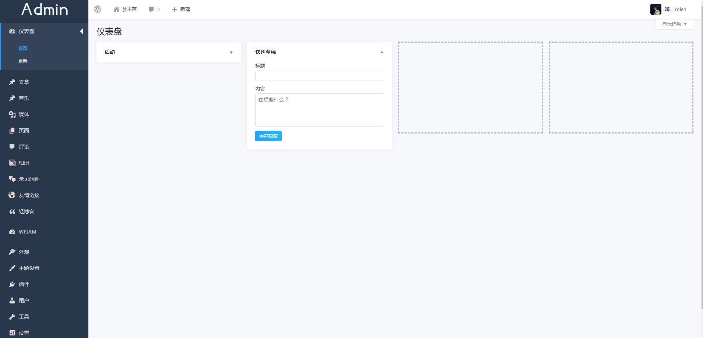

## yolen_admin
基于css和php组成的一款WordPress后台管理样式插件

## 获取
你可以直接访问yolen_admin的 GitHub 来获取最新版插件

https://github.com/imyolen/yolen_admin/

## 使用
WordPress后台直接上传安装，或使用ftp工具上传至`wp-content/plugins`目录即可。

## 预览
后台登陆

管理界面

## 其它
更多细节等你去体会。
